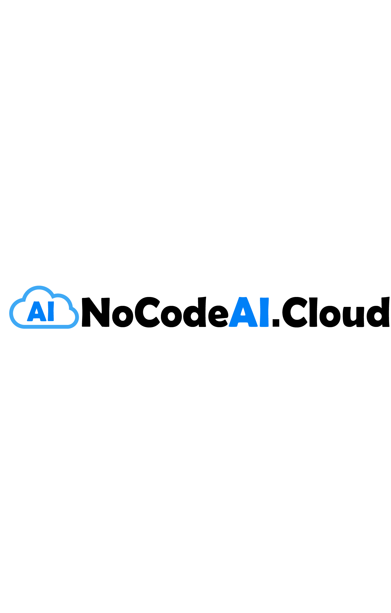

# NOCODEAI.CLOUD
## _Bring your Business Use Case Project to NoCodeAI and we will turn your Dream Project into reality._

NoCodeAI.Cloud is a US based company that is managed by a team of High level professionals with 60 plus years’ experience in Enterprise Data management, Cloud services, Artificial Intelligence, Machine Learning, Deep Learning, Business Process Development, Agile DevOps and the latest cutting edge technology in Robotic Process Automation (RPA) and HyperAutomation (HA). NoCodeAI.Cloud's AI/ML services can be broadly classified into the following 6 services: 1) Business Process Automation using AI/ML powered chatbots 2) AI/ML assisted manual data entry 3) Automated document processing 4) Speech to text transcription 5) Virtual customer assistant 6) Custom AI/ML applications development.

## Services
- GCP, AWS, Azure Cloud Services
- Context AIML Platform
- Google API AI Integration
- SQL & NoSQL DB Design
- WebApp Development
- Mobile React Development
- Data Lake Development
- Visual Dashboard Development
- Synthetic Data Generation
- Automated Site Testing
- UI/UX and Graphic Design
- AIML ChatBot Development
- Robotic Process Automation (RPA)
- HyperAutomation (HA)

## NoCodeAI Development Process

- Bring your Use Case
- Brainstorm with Us
- Software Development

## Tech
nocodeai.cloud uses a number of open source libraries and frameworks to work properly:

- [ReactJS] - HTML enhanced for web apps!
- [Re-Resizable] - awesome web-based resizable library.
- [React Drageline] - Used to Align the entrie Elements.
- [React Color] - great UI Color Picker for modern web apps.
- [React Icons] - Used to Manage our Icons.
- [React Google Chart] - Use to Visualize our Insights.
- [Material UI] - Use to Style our Components.
- [node.js] - evented I/O for the backend
- [Express] - fast node.js network app framework [@tjholowaychuk]
- [bcrypt.js] - For Password Algorithms
- [MySQL] - For Databse Management.

## Installation

nocodeai.cloud requires [Node.js](https://nodejs.org/) v10+ to run.

Install the dependencies and devDependencies and start the server.
## For Server Backend
```sh
cd nocodeai.cloud
npm i
nodemon
```
## For Client Side Frontend
```sh
cd client
npm i
npm run start
```

For production environments...

```sh
npm install --production
NODE_ENV=production node app
```


## License

NOCODEAI.CLOUD

**Free Software, Hell Yeah!**
